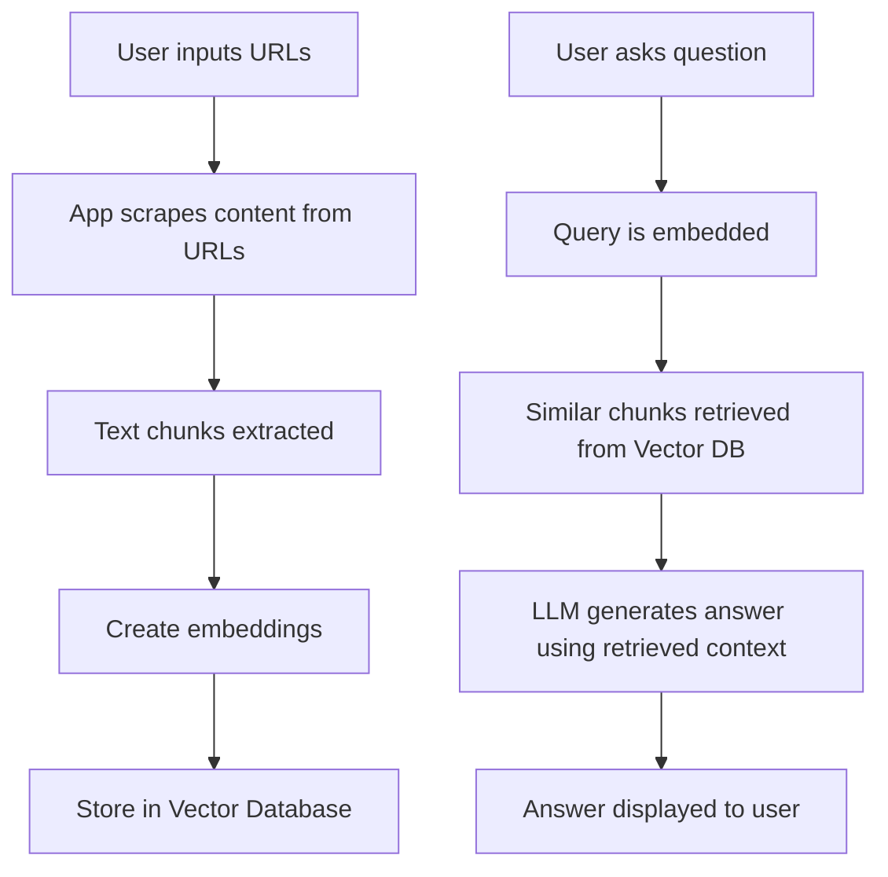

# URL Q&A App

A web application that allows users to input webpage URLs, scrape their content, and ask questions that are answered exclusively from the scraped information using a Retrieval-Augmented Generation (RAG) architecture.

## Features

- URL Input: Enter one or more URLs to scrape content from
- Content Ingestion: Extracts text content, creates embeddings, and stores in a vector database
- Question Answering: Asks questions against the scraped content
- RAG Architecture: Uses LangChain and a vector database to retrieve relevant content
- Clean UI: Built with Streamlit for a minimal, intuitive interface

## Workflow



## Architecture

This application uses a RAG (Retrieval-Augmented Generation) architecture:

1. **Retrieval**: Content from URLs is scraped, split into chunks, embedded, and stored in a vector database (FAISS)
2. **Augmentation**: When a question is asked, the most relevant chunks are retrieved from the vector database
3. **Generation**: The retrieved chunks are sent along with the question to an LLM (OpenAI), which generates an answer based only on the retrieved content

## Tech Stack

- **LangChain**: Used for the RAG pipeline, including document processing, embeddings, and LLM integration
- **FAISS**: Vector database for storing and retrieving embeddings
- **Streamlit**: For the web interface
- **OpenAI API**: For generating embeddings and answers
- **BeautifulSoup**: For web scraping

## Installation

1. Clone the repository:
   ```
   git clone https://github.com/yourusername/url-qa-app.git
   cd url-qa-app
   ```

2. Create a virtual environment:
   ```
   python -m venv venv
   source venv/bin/activate  # On Windows: venv\Scripts\activate
   ```

3. Install dependencies:
   ```
   pip install -r requirements.txt
   ```

4. Create a `.env` file:
   ```
   cp .env.example .env
   ```

5. Edit the `.env` file and add your OpenAI API key.

## Usage

1. Run the application:
   ```
   streamlit run app.py
   ```

2. Open your web browser and navigate to the URL displayed in the terminal (typically http://localhost:8501).

3. Enter your OpenAI API key in the sidebar.

4. Enter one or more URLs (one per line) and click "Process URLs".

5. Once the URLs are processed, enter your question and click "Ask".

## Project Structure

```
Web-Content-Q-A-Tool-/
├── app.py                  # Main Streamlit application
├── requirements.txt        # Python dependencies
├── README.md               # Project documentation
├── .env.example            # Example environment variables
├── src/
│   ├── scraper.py          # URL content scraping module
│   ├── embeddings.py       # Text embedding generation
│   ├── qa_chain.py         # Question-answering chain
│   └── vector_store.py     # Vector database management
├── utils/
│   ├── config.py           # Configuration utilities
│   └── logger.py           # Logging utilities
└── data/
    └── vector_db/          # Vector database storage
```
